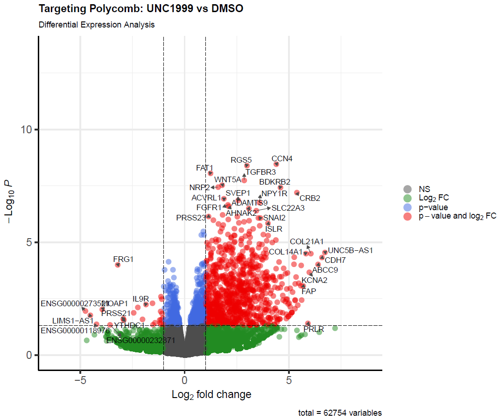

# 🧬 Análisis de RNA-seq en AML: Efecto de UNC1999

Este proyecto analiza el impacto de la inhibición del complejo **Polycomb 2 (PRC2)** mediante el fármaco **UNC1999** en líneas celulares de Leucemia Mieloide Aguda.

## 🛠️ Metodología
- **Pipeline:** Implementado en Nextflow (GCP).
- **Alineamiento:** HISAT2 sobre genoma de referencia hg38.
- **Análisis Diferencial:** DESeq2 (R) comparando UNC1999 vs DMSO.

## 📊 Resultados Destacados
El tratamiento indujo una respuesta asimétrica con una marcada reactivación de genes silenciados epigenéticamente.

